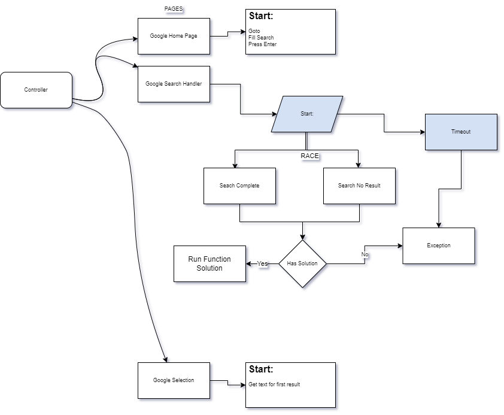

<h1 align="center">
  <br>
  <a href="https://github.com/ODGodinho"></a>
  <br>
  Stanley Crawler By Dragons Gamers
  <br>
</h1>

<h4 align="center">Template Stanley typescript for crawler/web-scraping playwright or puppeteer 🤖🚀!</h4>

<p align="center">

  

  <a href="https://www.linkedin.com/in/victor-alves-odgodinho/">
    
  </a>

  <a href="https://github.com/ODGodinho/Stanley-Crawler-node/commits/master">
    
  </a>

  

   <a href="https://github.com/ODGodinho/Stanley-Crawler-node/stargazers">
    
  </a>

</p>

## Table of Contents

-   [Libraries](#-libraries)
-   [Dependencies](#-dependencies)
-   [Installing and Updating](#installing-or-updating)
    -   [Install](#install)
-   [Start Project](#start-project)
-   [Variables Info](#variables-info)
-   [Project Diagram](#project-diagram)
    -   [Diagram Page](#diagram-page)
-   [Project Patterns](#project-patterns)
    -   [Page Pattern](#page-patterns)
        -   [Start Methods Rules](#start-methods-rules)
        -   [Optional Action in Page](#optional-action-in-page)
    -   [Controllers Patterns](#controllers-patterns)
    -   [Selectors Patterns](#selectors-patterns)
    -   [Handlers Patterns](#handlers-patterns)
        -   [Handlers Rules](#handlers-rules)

<br />

---

## 🖥 Libraries

#### `Crawler`

-   [Node.js](https://nodejs.org/)
-   [Typescript](https://www.typescriptlang.org/)
-   [Colors](https://github.com/Marak/colors.js)
-   [Puppeteer](https://github.com/puppeteer/puppeteer)
-   [Playwright](https://playwright.dev/)
-   [Eslint](https://eslint.org/)

## 📁 Dependencies

#### `Crawler`

-   [Node.js](https://nodejs.org) 14 or later
-   [Yarn](https://yarnpkg.com/) Optional/Recommended

<br>

## Installing Or Updating

---

### Install

To install use this template project and clone repository,

> remember to install all dependencies before starting this process.

```bash
bash ./start.bash
```

## Start Project

First install dependencies with the following command

```bash
yarn install
```

now run the following command to start

```bash
yarn prod
# or
yarn debug
```

## Variables Info

---

| $i                     | $$s                     | $s                    |
| ---------------------- | ----------------------- | --------------------- |
| Instances Pages Object | All Selectors Instances | Current Page Selector |

## Project Diagram

### Diagram Page

The following example shows how it was implemented with google search




## Project Patterns

### Page Patterns

Page Object Model is a common pattern that introduces abstractions over web app pages to simplify interactions with them in multiple tests. It is best explained by an example.

> now with some adaptations

-   > Pages names must end with Page

```typescript
import { PageContract } from "../../../@types/Page";
import BasePage from "../BasePage";

class GoogleSearchPage<PageType extends PageContract> extends BasePage<PageType> {
    /**
     * $s = current page selectors
     */
    public readonly $s = this.$$s.GoogleSearchSelector;

    /**
     * the start method is used to start all steps referring to this page
     */
    public async start(): Promise<this> {
        await this.goto();
        await this.fillSearch();
        await this.pressEnter();
        return this;
    }

    public async goto() {
        return this.page.goto(this.$s.GOOGLE_HOME_URL);
    }

    public async fillSearch() {
        const value = (Math.random() + 1).toString(36).substring(2, 18);
        return this.page.type(this.$s.SEARCH_INPUT, value);
    }

    public async pressEnter() {
        return this.page.keyboard.press("Enter");
    }
}

export default GoogleSearchPage;
```

#### Start Methods Rules

-   Only function calls are allowed
-   Must always return current class
-   Methods used by start must be public
-   Methods must always return the result of the last executed promise

#### Optional Action in Page

If you have any execution that is optional or your process cannot be terminated in case of error we strongly recommend the following pattern.

> Dont use try/catch, .catch(() => {}) on start is more elegant and visible

```typescript

    public async start(): Promise<this> {
        ...
        await this.clickAcceptCookie().catch(() => (/* Call log function if need */));
        ...
    }

```

### Controllers Patterns

Controller are responsible for defining the order that pages and handlers will be called.

> Controllers names must end with Controller

```typescript
import "colors";
import Instances from "../../@types/Instances";
import { PageContract } from "../../@types/Page";
import GoogleSelectionHandler from "../Handlers/Selection/GoogleSelectionHandler";
import initInstances from "../Pages/Pages";

class ExampleGoogleCrawlerController {
    /**
     * Current Page instance playwright/puppeteer
     */
    public page: PageContract;

    /**
     * all instances are saved in this object.
     *
     * @NOTE: use it to avoid recursive import loop
     */
    public $i: Instances<PageContract>;

    /**
     * You can create a baseController if you need to.
     */
    constructor(page: PageContract) {
        this.page = page;
        this.$i = initInstances(this.page);
    }

    public async exampleSearch(): Promise<void> {
        const GoogleSearch = await this.$i.GoogleSearchPage.start();

        const HandlerSearch = new GoogleSelectionHandler<PageContract>(GoogleSearch);
        await HandlerSearch.start();

        const GoogleSelect = await this.$i.SearchSelectionPage.start();
        console.log("Current Result:".bgCyan.black, GoogleSelect.firstElement);
    }
}

export default ExampleGoogleCrawlerController;
```

### Selectors Patterns

Selectors have some predetermined suffix rules, with them it is possible to understand selectors easily

> Selectors names must end with Selector

```typescript
/**
 * By declaring the constant it is possible to retrieve the redis/database selectors if it is convenient for your project
 *
 * @NOTE: create the Types file right here if you need
 */
const GoogleSelectionEmptySelector = {
    NOT_RESULT_ELEMENT: "#search div[role='heading']",
};

export default GoogleSelectionEmptySelector;
```

### Handlers Patterns

Handlers are used when we need to make decisions, when an action can return more than 1 different result, a practical example would be the login can return (logged in, Incorrect password, Forbidden)

A simple example to show how we can use them properly

```typescript
import { PageContract } from "../../../@types/Page";
import BaseHandler, { HandlerFunction, HandlerState } from "../BaseHandler";

class GoogleSelectionHandler<PageType extends PageContract> extends BaseHandler<PageType> {
    public identifyHandler(): Promise<HandlerFunction> {
        return Promise.race([this.identifyLoginCompleted(), this.identifyLoginForbidden(), this.identifyLoginFail()]);
    }

    public async defaultTimeout(): Promise<number> {
        return 30000;
    }

    private async identifyLoginCompleted() {
        return this.page
            .waitForSelector(this.$$s.LoginSelector.LOGIN_COMPLETED_ELEMENT, { timeout: await this.defaultTimeout() })
            .then(() => this.resolvedSolution.bind(this)); // resolvedSolution continue the process normally
    }

    private async identifyLoginForbidden() {
        return this.page
            .waitForSelector(this.$$s.LoginSelector.LOGIN_FORBIDDEN_ELEMENT, { timeout: await this.defaultTimeout() })
            .then(() => this.forbiddenSolution.bind(this));
    }

    private async identifyLoginFail() {
        return this.page
            .waitForSelector(this.$$s.LoginSelector.LOGIN_FAIL_ELEMENT, { timeout: await this.defaultTimeout() })
            .then(() => this.retryLoginSolution.bind(this));
    }

    private async forbiddenSolution() {
        throw new Error("User Blocked");
    }

    /**
     * When returning Verify in the handler it will be executed again to verify the new status, in this case as we re-try to log in we need to know what the new status is.
     */
    private async retryLoginSolution() {
        await this.page.goBack();
        await this.$i.LoginPage.start();
        return HandlerState.VERIFY;
    }

    public async start(): Promise<any> {
        const solution = await this.identifyHandler();
        return this.runSolution(solution);
    }
}

export default GoogleSelectionHandler;
```

#### Handlers Rules

-   It should always contain a promise.race to identify which case it fell into
-   Cases must return the function for Run Solution to execute
-   functions with solutions must have the suffix Solution
-   Promise.Race functions must have the identify prefix
-   Define a number of attempts for your handler because if it has any HandlerState.VERIFY it will run in a loop until it falls into another condition
-   Handler should be used to handle "Not Happy" cases
